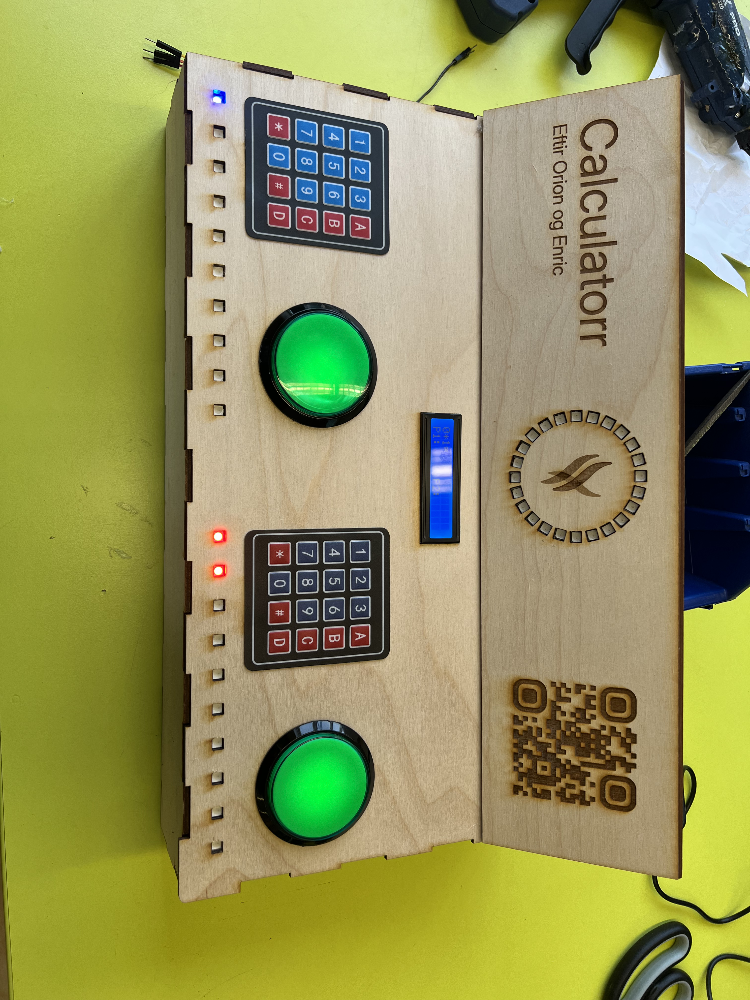
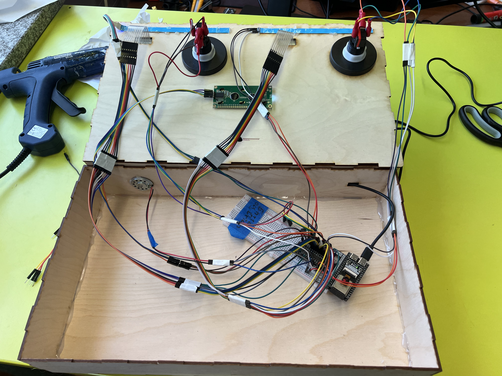

# Calculator - Orion og Enric
**Inngangur**

**Reglurnar:** 
Leikurinn Calculatorr er stærðfræðileikur fyrir **2 spilara**.
Á skjánum mun koma Stærðfræði Dæmi.
Spilarar reikna dæmin og setja svörin í Borðið Og svo Smella í Stóra takkan til að seta inn svar.
Sá sem fyrstur skrifar rétta svarið vinnur Stig.
Fyrstur í 10 Stig Vinnur.
Ef þú setur inn rangt svar fær aðstæðingur 1 stig. 

**Hvernig á að byrja?**
 
Smelltu á Stóra Græna takkan.
Þú hefur 3 sekúndur til að leikurinn byrji.
Þegar leikur byrjar birtist dæmi á skjánum. 

Decoration: https://github.com/enricosolbe/T-maverkefni-4/blob/main/Decoration.stl
Reglunar PDF: https://github.com/enricosolbe/T-maverkefni-4/blob/main/Reglunar%20Calculatorr.pdf
Video: https://youtu.be/w6FRSDXZKaU
