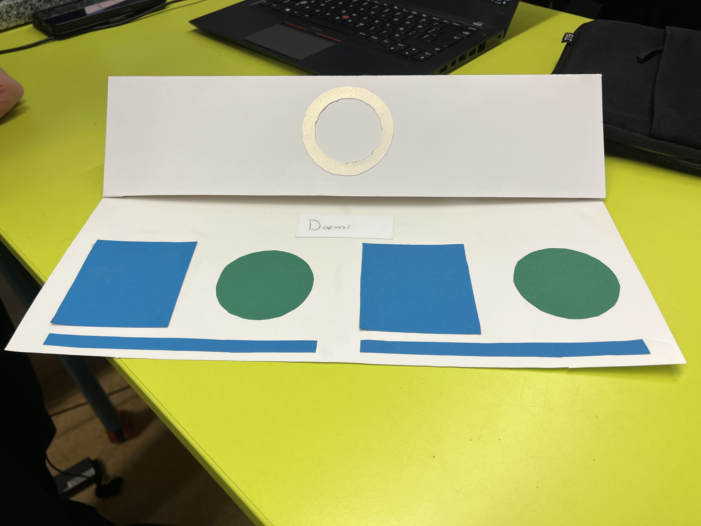

# Calculator - Orion og Enric
**Inngangur**

**Reglurnar:** 
Leikurinn Calculatorr er stærðfræðileikur fyrir **2 spilara**.
Á skjánum mun koma Stærðfræði Dæmi
Spilarar reikna dæmin og setja svörin í Borðið Og svo Smella í Stóra takkan til að seta inn svar.
Sá sem fyrstur skrifar rétta svarið og lærir hnappinn vinnur Stig. Firstur í 10 Stig Vinnur
Ef þú slærð inn rangt svar færðu -1 stig. Sá sem nær fyrstur -5 stigum tapar. Firstur Í -5 Stig Tapar.

**Hvernig á að byrja?**
Smelltu á „Byrja“. Þú hefur 5 sekúndur til að leikurinn byrji.
Þegar LED-ljósið verður grænt birtist dæmi á skjánum sem þú þarft að vinna þig í gegnum.
Ef persónan vinstra megin slær inn rétt svar kviknar á vinstri LED-ljósinu og viðkomandi fær stig.

https://github.com/enricosolbe/T-maverkefni-4/blob/main/Reglunar%20Calculatorr.pdf
